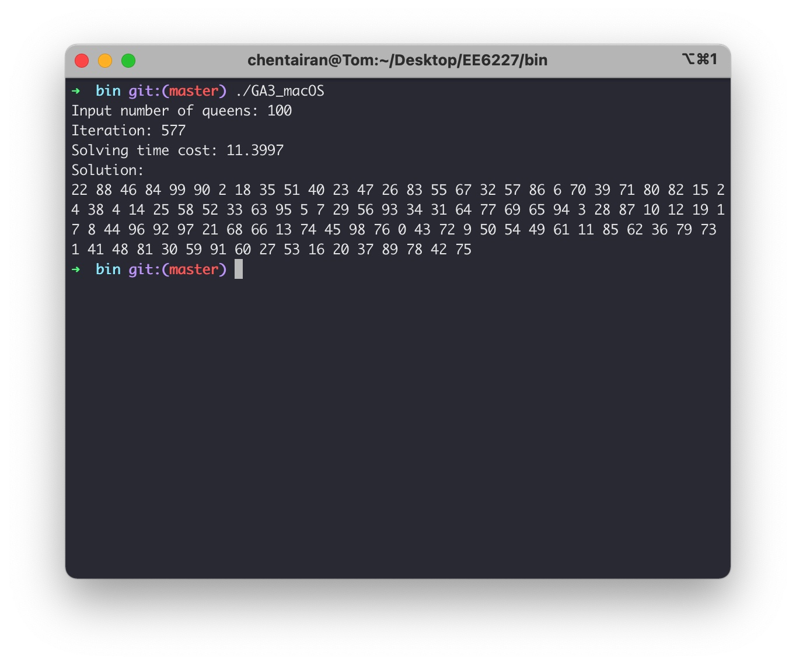

# EE6227 Assignment 3

Name: Chen Tairan

If you have any issue about the code running, do contact me: tchen008@e.ntu.edu.sg

## 1. Requirements

This code is written in C++. Thus if you want to build from source code, your system should have a C++ compilation environment. For convenience, I have also provided binary files that can be run under **macOS, Windows or Ubuntu**. Next I will describe the two methods of running from binary files and building from source code, respectively, under different operating systems.

---

### a. Run from binary files

In the `bin` directory there are my pre-compiled executable files, you can select the executable file that corresponds to your system to run.

#### Windows

Double-click the `GA3_Windows.exe` file

#### macOS / Ubuntu

Open a terminal in the `bin` directory

```bash
./GA3_macOS	# if you use intel-based Mac
./GA3_Ubuntu	# if you use Ubuntu
```

**Note: These binaries are only valid for testing in my environment, if they fail to run, please build from source code !!!**

---

### b. Build from source code

#### Windows

```bash
g++ main.cpp Genetic.cpp -o GA3 -std=c++11 -static
.\GA3.exe
```

#### macOS / Ubuntu

**Option1: Using g++ compiler**

```bash
g++ main.cpp Genetic.cpp -o GA3 -std=c++11
./GA3
```

**Option2: Using cmake & make**

```bash
cd /path/to/this/code  # Change to your own code path
mkdir build
cd build
cmake ..
make
./GA3
```

The following images show the results of the run:



## 2. Benchmark

I tested the results when **the number of queens is 4 to 200.** **The results of the test are saved to `result.txt`.**

I also give the evaluation code `benchmark.cpp` to reproduce the results of this algorithm.

**Note that: If you just want to see the final result, you can check the `result.txt` file directly.**

```bash
# Evaluation Code build from source, option1, if you use g++
g++ benchmark.cpp Genetic.cpp -o GA3_benchmark -std=c++11
./GA3_benchmark	# if Windows, .\GA3_benchmark.exe

# Evaluation Code build from source, option2, if you use cmake & make
mkdir build
cd build
cmake ..
make
./GA3_benchmark # if Windows, .\GA3_benchmark.exe
```

This code will run for a long time because it tries a number of 4 to 200 different queens. After the run is complete, the results will be saved to the `result.txt` file.

## 3. Algorithm description

To make the algorithm run faster and reduce unnecessary gene generation, I introduced the domain knowledge about the N-Queen problem. I will present my improvements in the **Crossover** and **Mutation** section.

### a. Crossover

The algorithm checks whether the adjacent elements in the chromosome differ by only 1, because if the difference is 1, then the two Queens will be checked. So the algorithm swap the elements of the chromosome in this position to break the check.

### b. Mutation

The algorithm first de-duplicates the elements in the chromosome, and then completes the missing elements, after which the pair of element positions are randomly exchanged.
