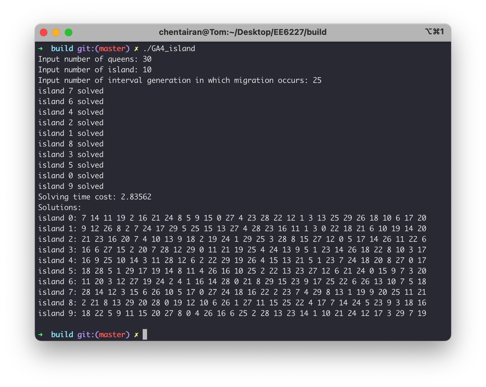
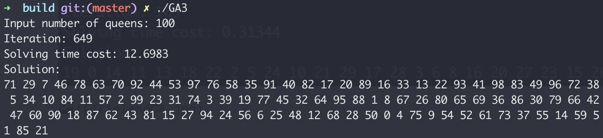
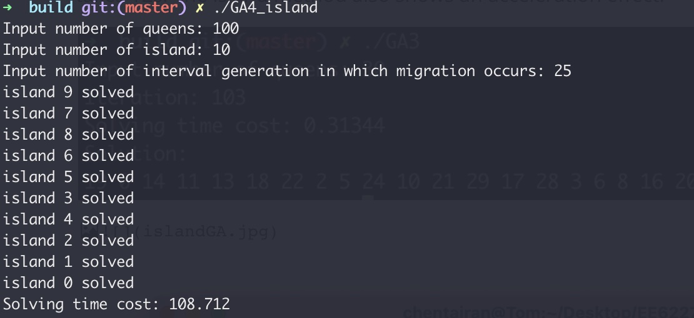

# EE6227 Assignment 4

## 1. Requirements

This code is written in C++. Thus if you want to build from source code, your system should have a C++ compilation environment. For convenience, I have also provided binary files that can be run under **macOS, Windows or Ubuntu**. Next I will describe the two methods of running from binary files and building from source code, respectively, under different operating systems.

---

### a. Run from binary files

In the `bin` directory there are my pre-compiled executable files, you can select the executable file that corresponds to your system to run.

#### Windows

Double-click the `GA4_island_Windows.exe` file

#### macOS / Ubuntu

Open a terminal in the `bin` directory

```bash
./GA4_island_macOS	# if you use intel-based Mac
./GA4_island_Ubuntu	# if you use Ubuntu
```

**Note: These binaries are only valid for testing in my environment, if they fail to run, please build from source code !!!**

---

### b. Build from source code

#### Windows

```bash
g++ islandGA.cpp Genetic.cpp -o GA4_island -std=c++11 -static
.\GA4_island.exe
```

#### macOS / Ubuntu

**Option1: Using g++ compiler**

```bash
g++ islandGA.cpp Genetic.cpp -o GA4_island -std=c++11
./GA4_island
```

**Option2: Using cmake & make**

```bash
cd /path/to/this/code  # Change to your own code path
mkdir build
cd build
cmake ..
make
./GA4_island
```

The following images show the results of the run:



## 2. Compare islandGA with Normal GA

I compare island GA with normal GA. For the normal GA, the time taken to solve for an n=30 solution is 0.31344s. And the time taken for island GA to solve for **island=10, n=30 is 2.83562s, averaging 0.283s per solution**. The island method speeds up the solver.

I also test the case when **n=100**. **Island GA takes 108.712s (averaging 10.8712s per solution)**, and **normal GA takes 12s.** The island method also shows an acceleration effect. The following figures show the results of the two GA algorithms respectively.





## 3. Island GA implementation

The algorithm is implemented as follows:

- Firstly, **k** GA solvers are constructed, and they are randomly initialized. 

- Based on the iterations of the original GA, **m** chromosomes are randomly selected from the solver every **t** iterations and put into the next solver.

- Stop iterating when all solvers have found a solution

Implementation details can be found in `islandGA.cpp` and `Genetic.cpp`

